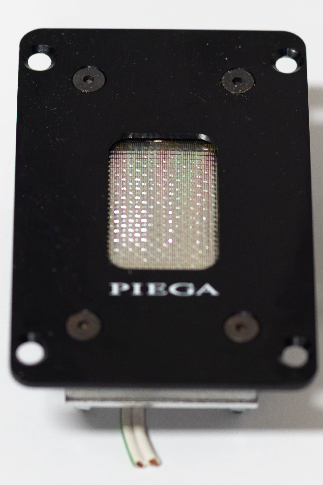
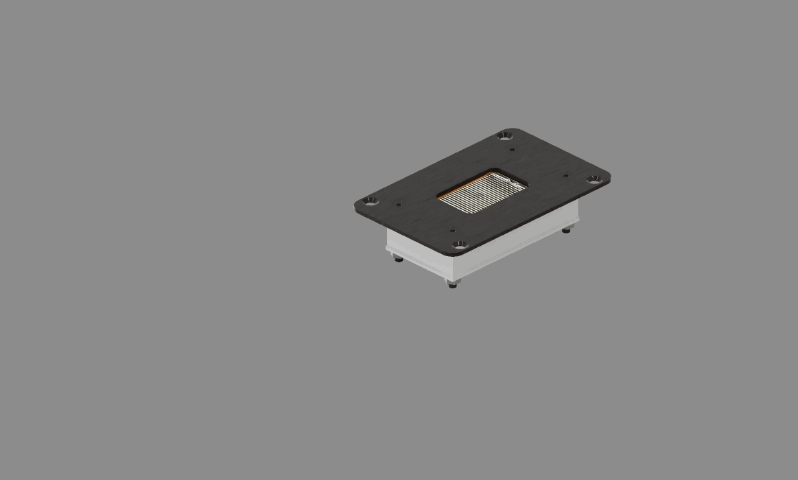

# Piega LDR II Ribbon: Teardown & Reverse-Engineering Analysis

A full teardown of a **Piega LDR II ribbon tweeter** (Linear Drive Ribbon, generation II), salvaged from a pair of **Piega P 4 XL MK II** floorstanders acquired second-hand via Ricardo. Despite the "ribbon" name, the driver is a **planar-magnetic** design. This writeup maps its construction, explains how it works, diagnoses the fault in the salvaged units, and draws design lessons for original planar drivers.

> **Provenance:** Piega P 4 XL MK II, a 3-way Swiss bass-reflex floorstander of the early 2000s, rated 89 dB / 4 Ω. "DC / direct-coupled" appears in this writeup as a working description of the driver's no-transformer operation, not as Piega's designation.



## Summary

The driver is a direct-coupled (**2.8 Ω**) planar-magnetic tweeter: an aluminised-Kapton membrane carrying two parallel etched spirals, driven by a **single-ended, alternating-polarity (N-S-N)** array of three neodymium bar magnets on a steel yoke. The salvaged units played quiet, and the fault is **oxide jacking**: corrosion of the neodymium magnets lifting their plating into a hard crust that ate the magnetic field (cutting sensitivity) and jammed the diaphragm off its rest position. The measurements show the consequence clearly: in its real passband (above the ~3.5 kHz crossover) even these aged units are flat and clean, so the damage cost *output*, not in-band distortion. The alarming distortion seen below the crossover is the normal below-passband artifact, not a fault.


## Key findings

- **It's a planar, not a ribbon.** Piega's **LDR II** is a 2.8 Ω etched aluminium trace on Kapton, driven directly with no matching transformer; hence the "direct-coupled" shorthand used here.
- **Single-ended N-S-N motor.** Three ~50×10×5 mm neodymium bars, ~5 mm apart, alternating polarity (confirmed with a spare ferrite magnet), on a soft-steel yoke with a steel front plate completing the circuit.
- **Parallel twin-spiral coil.** Two concentric spirals in parallel halve resistance and inductance, keeping the driver fast and easy to drive at the top of the band.
- **Selective pleating.** Fine corrugation in a ~4-corrugated : 1-flat repeat; compliance tuned spatially for modal control, not uniform stiffening.
- **Deliberate dummy traces.** ~8 unwired strips over the dead-field centre keep mass/stiffness uniform and the etch even.
- **Failure = oxide jacking.** One corrosion mechanism, two effects: magnetic (dead oxide collapses the field, so the driver loses sensitivity and plays quiet) and mechanical (the crust jacks the diaphragm off its rest position).
- **Measured and verified.** Above the ~3.5 kHz crossover, both aged units measure flat and closely matched at well under 0.5 % THD. The natural roll-off knee (~2.7 kHz) sits right where Piega crossed the ribbon over. The huge distortion below the crossover is the expected below-passband artifact, filtered out in the speaker.



## Read the full analysis

→ **[report/Piega_LDR_II_Ribbon_Teardown_Analysis.md](report/Piega_LDR_II_Ribbon_Teardown_Analysis.md)**

## Quick specs

| Parameter | Value |
|---|---|
| Model | Piega LDR II ribbon tweeter (from P 4 XL MK II) |
| Type | Planar-magnetic (marketed as ribbon), direct-coupled |
| Host speaker | 3-way floorstander, 89 dB, 4 Ω, early-2000s |
| Tweeter crossover | ~3.5 kHz |
| DC resistance | 2.8 Ω |
| Coil | Two concentric spirals, wired in parallel |
| Active area | 25.8 × 41.8 mm |
| Magnets | 3 × NdFeB bars, ~50×10×5 mm, ~5 mm apart, N-S-N |
| Motor | Single-ended, steel rear yoke + steel front plate |
| Diaphragm | Aluminised Kapton, conductor-side outward, ~7 µm / ~7 mg |
| Air gap | ~1.6 mm (rubber spacer) |
| In-band THD (≥ 3.5 kHz) | median ~0.2 to 0.4 % |

Full measurements and raw sweeps: **[data/measurements.md](data/measurements.md)**

## Repository structure

```
report/    full teardown analysis
figures/   scans, photographs, and measurement plots
data/
  measurements.md   specifications + acoustic summary
  raw/              REW frequency-response and distortion exports (both units)
```

## License

Text, figures, and data are released under **[CC BY 4.0](LICENSE)**; reuse freely with attribution.

## Documentation note

The work and conclusions in this repository are my own. I used an AI assistant as a writing aid to draft and structure these reports from my raw notes.
