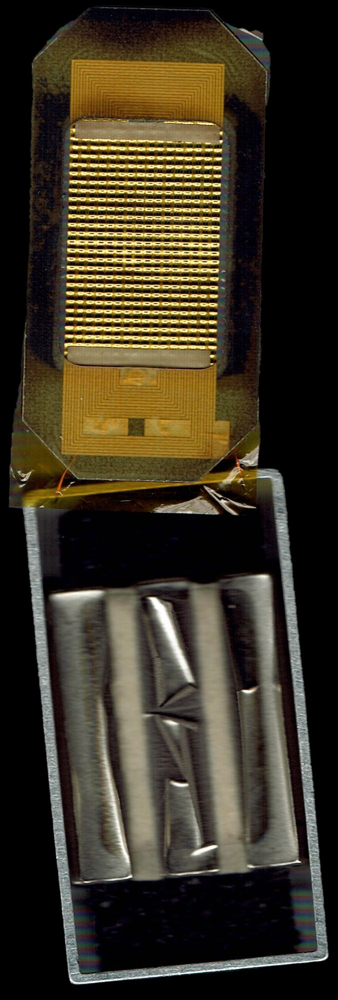
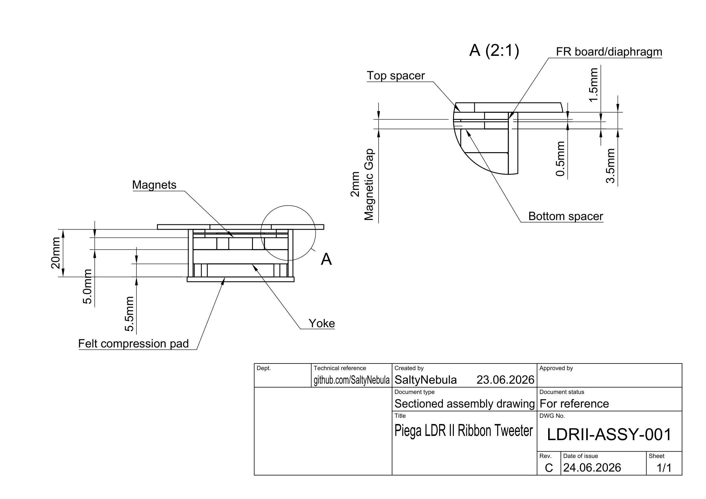
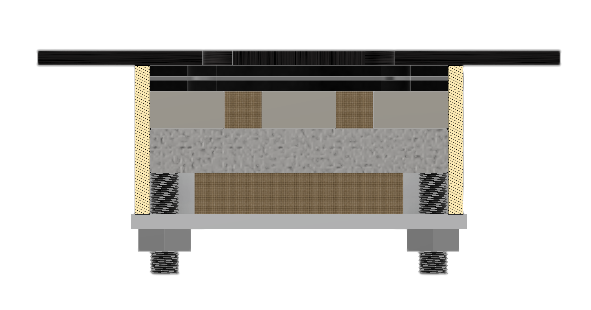
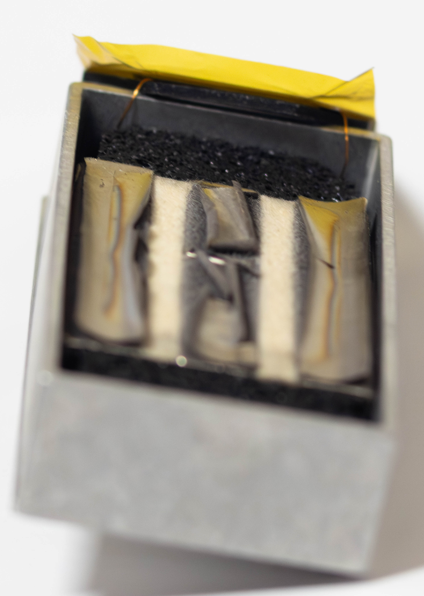
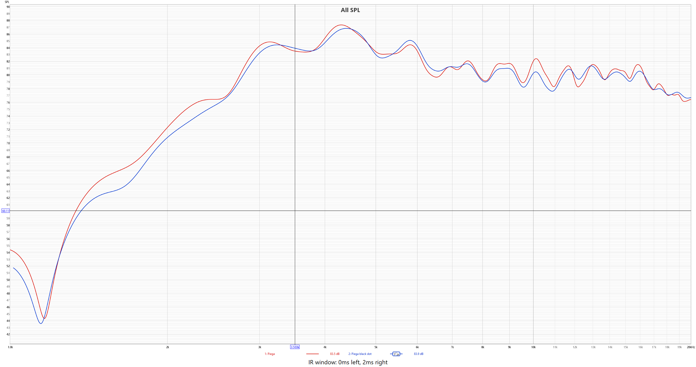
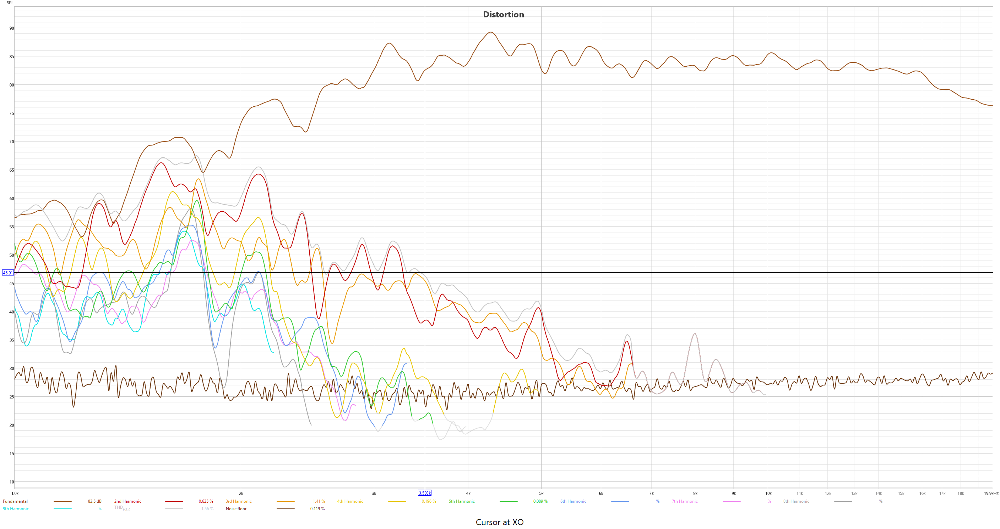

# Reverse-Engineering a Piega LDR II Ribbon

### A teardown analysis of a Piega LDR II linear ribbon tweeter, from the P 4 XL MK II

> **Provenance.** Driver salvaged from a pair of **Piega P 4 XL MK II** floorstanders: a 3-way Swiss bass-reflex design of the early 2000s, rated 89 dB / 4 Ω, acquired second-hand via Ricardo. The tweeter is Piega's own **LDR II** (Linear Drive Ribbon, generation II). "DC / direct-coupled" is used in this writeup as a working description of the driver's no-transformer operation, not as Piega's designation.

---

## 1. What this driver actually is

Piega is a Swiss high-end loudspeaker manufacturer whose signature technology is the "ribbon" driver. The unit examined here is the **LDR II** (Linear Drive Ribbon, generation II): the ribbon tweeter from the P 4 XL MK II, where it serves as the high-frequency driver in a 3-way system.

The first thing worth clearing up is the name. Despite being marketed as a *ribbon*, this is technically a **planar-magnetic driver**, and the distinction matters:

- A **true ribbon** is a single strip of conductive foil suspended in a magnetic field. The foil is *both* the conductor and the moving surface. Because a bare foil strip has almost no resistance (typically 0.1 to 0.5 Ω), it cannot be connected to an amplifier directly; it needs a step-up transformer to match it to the amp.
- A **planar-magnetic** driver uses a thin plastic film (here, Kapton) with a separate conductive trace pattern printed or etched onto it. The film is the moving surface; the trace is the "voice coil." Because the trace can be made long and thin, its resistance is sane (this one measures **2.8 Ω**), so it can be driven **directly** with no transformer.

Throughout this writeup the driver is described as *direct-coupled* ("DC"): a working description of that no-transformer property, not Piega's own designation (their name for it is the LDR II). The 2.8 Ω measurement confirms it: this is a driver you can hang straight off a normal amplifier through a passive crossover.

*Figure 1: Diaphragm (conductor side) above its magnet plate.*
---

## 2. The operating principle

Every driver here obeys the same piece of physics, the **motor law**:

> Force = B × I × L

A conductor carrying current **I**, of length **L**, sitting in a magnetic field of strength **B**, feels a force at right angles to both. Reverse the current and the force reverses; feed it an audio signal and the surface pushes and pulls the air in step with the music.

Two terms are worth keeping in mind for later:

- **BL** ("force factor") is the product of field strength and conductor length in the field. It sets how much force you get per amp of signal: in plain terms, the driver's **efficiency**. Lose BL and the driver goes quiet.
- **Br** ("remanence") is the field strength a permanent magnet produces. It is the **B** in the equation above, so anything that weakens the magnets directly weakens the driver.

The advantage of the planar layout is that the driving force is applied **across the whole membrane at once**, wherever the traces run, rather than injected at a single point and propagated outward the way a conventional cone is driven through its voice coil. Combined with an extremely light membrane, this gives the fast, clean transient response these drivers are prized for. It also makes them unusually tolerant of localised damage, since no single point is doing all the work.

---

## 3. Construction at a glance

*Figure 2: dimensioned assembly section (see also figures/ldrii_assembly_drawing.pdf)*

*Figure 1: Split view of driver with textured components.*

From the listening side inward, the driver is a simple sandwich:

| Layer | Material | Approx. dimension |
|---|---|---|
| Front plate | Aluminium, with a rectangular window (non-magnetic) | 2 mm thick; opening ≈ 25.8 × 41.8 mm |
| Spacer / gasket (listener side) | Hard rubber | ≈ 1.5 mm |
| Diaphragm | Aluminised Kapton, conductor-side outward | conductor a few microns thick |
| Carrier frame | FR-type fibreboard, windowed (diaphragm bonded to its front face) | ≈ 0.5 mm |
| Spacer / gasket (magnet side) | Hard rubber | ≈ 1.5 mm |
| Magnets | 3 × neodymium bars | each ≈ 50 × 10 × 5 mm, ≈ 5 mm apart |
| Rear yoke | Soft steel plate joining all three magnets | ≈ 5 mm |
| Damping | Felt | thin |

The full internal cavity is roughly **81 × 41 mm**, but the **active radiating area is only 25.8 × 41.8 mm**: a point we return to in the design notes, because the difference is mostly "dead" area.

A striking feature is how *little* adhesive the whole thing uses. The inter-magnet gaps and the spaces above and below the magnets are filled with **removable felt** (acoustic damping, not structural potting). There are really only **two glued joints in the entire driver**: the magnets bonded to the steel yoke, and the Kapton bonded to its frame. Everything else is mechanical assembly held together by four screws. The diaphragm's carrier frame is a **translucent fibreboard that looks like FR-grade (glass-fibre/epoxy) laminate**: a common workshop material, not a proprietary moulding.

---

## 4. The motor (magnet system)

Three neodymium bar magnets sit *behind* the diaphragm; none on the sides, none on the front. This is a **single-ended** magnet system. A soft-steel yoke behind the magnets ties them together magnetically and provides the field's return path. The front plate is aluminium (confirmed non-magnetic with a ferrite magnet), so it takes no part in the magnetic circuit; it is structure and protection only. The motor is therefore purely single-ended off the rear yoke, with nothing magnetic in front of the diaphragm.

The three bars are arranged in **alternating polarity, N-S-N**. This was confirmed without any specialist tools: presenting the same face of a spare ferrite magnet to each bar in turn, the two outer bars *attracted* it while the middle bar *repelled* it. Alternating polarity is what makes the motor work. Between two oppositely-poled bars, the magnetic field runs **horizontally across the gap**, parallel to the diaphragm, and it is that in-plane field that produces useful (perpendicular) force on the conductors running over the gaps. Over the centre of each bar the field points straight up, which does **not** drive the membrane outward; only the gap regions do real work. The serpentine/spiral trace pattern is laid out so the current direction reverses from one gap to the next, matching the alternating field so all the forces add.

Single-ended is the right choice *for a tweeter*. The membrane barely moves, so the fact that the field weakens with distance from the magnets (which would normally cause distortion as the diaphragm swings in and out of a stronger or weaker field) simply doesn't have room to express itself. The reasons to add magnets on *both* sides are covered in the design notes.

*Figure 3: Alternating N-S-N bar magnets and rear plate. (The motor is also visible in Figure 1.)*

---

## 5. The diaphragm and "voice coil"

The diaphragm is **aluminised Kapton**: the familiar amber polyimide film, with an etched aluminium conductor on one face. (Piega quote a conductor around 7 µm thick and a moving mass of roughly 7 milligrams, which is consistent with what's here.) Aluminium is chosen over copper deliberately: it is about a third of the density, so the membrane stays light, which is what buys the high-frequency extension and speed.

The film is mounted **conductor-side-out**: the aluminium traces face the front plate, and the bare Kapton faces the magnets. This orientation turns out to be quietly important, as Section 7 explains.

The conductor itself is **two concentric rectangular spirals wired in parallel**, terminating in four contact pads that collapse to two terminals, with two fine lead wires routed to the rear. Wiring the two spirals in parallel **halves both the resistance and the inductance** versus a single long spiral. Lower inductance is exactly what you want at the top of the audio band, so for a tweeter this is a feature, not a compromise; it keeps the driver fast and keeps the impedance flat and easy to drive.

Measured terminal resistance is **2.8 Ω**, confirmed both at the external terminals and directly at the diaphragm pads.

One inefficiency stands out. The **active** trace area is only 25.8 × 41.8 mm, but the trace pattern occupies the full ≈ 81 × 41 mm footprint. The extra area is **bus routing**, the wiring that carries current to and from the active loops, and it sits *on the moving membrane*, where it adds series resistance and moving mass while producing no sound. This is a design point worth improving on (Section 10).

*Figure 3: Diaphragm front (radiating face), trace pattern backlit.*

---

## 6. The pleating: corrugation as modal control

The membrane is **corrugated**: finely pleated in one direction, much finer than the corrugation on a conventional ribbon. (An earlier impression that it was textured with a two-dimensional bump field turned out to be a moiré illusion from product video; it is a simple, fine transverse pleat.)

What's clever is that the pleating is **not uniform**. The pattern runs roughly **four corrugated traces, then one flat column, repeating**. This is deliberate compliance shaping:

- The **corrugated bands** stiffen the membrane against unwanted bending and help break up standing waves.
- The **flat columns** act as built-in **hinge lines**: controlled places where the membrane is *allowed* to flex.

Corrugating the entire surface would over-stiffen it and fight the very motion you are trying to drive. Selectively pleating it lets the designer decide *where* the membrane is rigid and *where* it is compliant; in other words, it tunes the **modal behaviour** (the pattern of resonances) directly into the geometry of the diaphragm. It is a notably more sophisticated approach than "corrugate it for stiffness," and the pleat period very likely maps onto the magnet bar-and-gap spacing: stiff over the active zones, compliant in between.

---

## 7. The dummy traces (and why the failure wasn't worse)

Down the centre of the active area sit roughly **eight conductor strips that are not wired to anything**; they carry no current. At first glance this looks like a mistake. It isn't.

These strips lie **directly over the centre of the middle magnet**, exactly where the field points straight up and can produce no useful driving force. So there is no point wiring them. But they aren't left as bare Kapton either, and that is the deliberate part. Aluminised film and bare film have **different mass and different stiffness**. A bare stripe down the middle of a driven membrane would be lighter and floppier than its surroundings; it would lag behind, flap, and seed its own resonance right in the radiating area. The **dummy strips keep the mass and stiffness uniform** so the whole membrane moves as one piece.

There is almost certainly a **manufacturing reason** riding along too. In an etching process, areas with uniform pattern density etch at a uniform rate; a large blank area next to fine traces etches differently ("etch loading") and throws off the dimensions of the real traces nearby. Filling the dead zone with dummy features keeps the etch even, the same reasoning behind copper-balancing fill on a printed circuit board. The strips serve acoustics and fabrication at once.

The conductor-side-out mounting (Section 5) is what kept the eventual failure from being catastrophic: the fragile aluminium traces face *away* from the magnets, so when the motor failed, it was the tough Kapton side, not the conductor, that took the damage.

---

## 8. The failure: oxide jacking

The salvaged units played audibly quiet, and the original measurements looked odd at the bottom of the sweep (more on why that impression was partly misleading in Section 9). On disassembly the cause was clear: a textbook but rarely-witnessed failure mode, **oxide jacking** of the neodymium magnets.

Neodymium (NdFeB) magnets corrode readily, so they are plated, typically nickel-copper-nickel. Over decades, moisture eventually works under the plating and the magnet begins to corrode from the **grain boundaries inward**. Corrosion products take up **more volume** than the metal they replace (the same mechanism as rust jacking, where rusting steel cracks concrete). That expansion levers the plating off the magnet face as a hard, buckled **crust**.

That one mechanism does two separate things to the driver:

1. **Magnetic (the dominant audible effect).** The corrosion ate into the working faces of the magnets and converted magnet material into magnetically **dead oxide**. The field **B** in the gap fell, **BL** fell with it, and the driver lost sensitivity. This is the real, measurable signature of the fault, and it matches the recollection that these "90 dB-ish" drivers played audibly quiet.
2. **Mechanical.** The crust grew tall enough to bridge the ~2 mm gap and pressed against the diaphragm, jacking it up off its rest position and reducing its clearance (worst opposite the centre magnet, which was the most corroded). The driver felt strangely "over-tensioned" by hand; it was actually jammed. Importantly, this did *not* translate into gross distortion in the driver's passband, for the reason given in Section 9: a tweeter's in-band excursion is so small that a shifted rest position has very little room to misbehave.

By the end, the corrosion had gone clean through: the bars had separated along their own corroded planes top and bottom, so the magnets lifted away with almost no force, leaving the *adhesive* perfectly intact. The driver didn't fail at any joint a designer chose; it failed inside the magnet metal itself, after the better part of two decades of slow, passive corrosion.

*Figure 4: Lifted plating crust on the magnet faces, most severe on the centre bar. (Visible in Figure 1.)*

---

## 9. What the measurements show

Two pre-teardown sweeps survive for each of the two units (frequency response and harmonic distortion, captured on a USB measurement microphone into a portable recorder, handheld and uncalibrated, with a 2 ms quasi-anechoic gate). The full files are in `data/raw/`. They turn out to tell a more interesting story than "the driver is broken."

**The crossover reference.** Piega's own published figures for this exact ribbon (the 26 × 45 mm LDR II-S, which is the 25.8 × 41.8 mm active area measured here) put the tweeter crossover at **about 3.5 kHz** in a 3-way design. That is the frequency to judge the driver against, because below it the driver is filtered out in the speaker and never asked to play.

**Frequency response matches the crossover.** Both units roll in with a natural minus-3 dB knee at **about 2.7 kHz** and are essentially flat from roughly 3 kHz to 20 kHz. Piega's 3.5 kHz crossover therefore sits about a third of an octave *above* the driver's natural knee, which is textbook tweeter integration: you place the electrical high-pass a little above the acoustic roll-off so the two combine into a clean slope and the driver only ever works where it is flat. The two units track each other almost exactly through the whole passband, which is notable for two roughly 20-year-old, differently-corroded samples. A deep, narrow notch near 1.2 kHz is present and near-identical in *both* units, which marks it as a genuine shared feature (diaphragm behaviour below the passband, or a common measurement artifact) rather than damage to one unit; either way it sits well below the crossover and is irrelevant to use.

*Figure 5: Frequency response of both units (1/24-octave). The cursor at 3.5 kHz sits right on the knee where the response steps up onto its plateau.*

**Distortion is low where it counts.** In the real passband (at and above 3.5 kHz), total harmonic distortion is excellent: a median of about **0.2 to 0.4 %**, with peaks barely reaching 1 to 2 %. The alarming part of the raw data, distortion of 45 % to 170 % below 1.5 kHz, is **not the driver tearing itself apart**. It is the standard artifact of measuring a tweeter below its passband: the fundamental collapses down there because the driver cannot radiate it, while that tone's 2nd and 3rd harmonics land back up at 2 to 5 kHz where the driver *is* efficient, so the ratio of harmonics to fundamental explodes. All of that is below the 3.5 kHz crossover, so the speaker never lets the driver make it.

*Figure 6: Distortion. Above the crossover the harmonic traces fall toward the noise floor; below it the fundamental rolls off while harmonics remain in band, which is the out-of-band artifact, not a fault.*

**Why the original impression was misleading.** The first reading of these sweeps, a year before the teardown, took that out-of-band distortion as evidence of a fault. The misread came from a woofer habit of mind: a woofer is the unusual driver that plays cleanly across nearly its whole range, so huge distortion at the bottom of a sweep genuinely signals trouble there. A tweeter measured below its crossover always looks like that. So the "weird response and high distortion" that first prompted this investigation was really two things: genuinely reduced output (the sensitivity loss from Section 8) and a normal below-passband artifact misread against woofer expectations. The teardown then revealed the real, dramatic fault, which was magnetic, not a distortion problem.

**What the data cannot show, in fairness:**

- The levels are relative and uncalibrated, so the sensitivity loss (the actual audible fault) does not appear in these normalised sweeps.
- Above the crossover the harmonic products fall toward the measurement noise floor, so the in-band *harmonic breakdown* is noise-limited rather than a clean read of the driver. At the crossover cursor the 3rd harmonic actually leads the 2nd, so this data does not support an even-order, single-ended distortion signature.
- A single on-axis sweep integrates the whole diaphragm, so it cannot localise distortion to the centre over the middle magnet; testing that prediction would need a scanning or sectional measurement.

**The takeaway.** In its real operating band, even these aged, partly-jammed units measure flat and closely matched, at well under half a percent distortion. The dramatic motor damage shows up as lost *output*, not added in-band distortion, which is exactly what you would expect of a tweeter whose in-band excursion is microscopic. It is a useful lesson in its own right: a planar tweeter can be visibly, severely damaged in its motor and still measure clean in the band it actually plays.

---

## 10. Design implications: what I would change

Reverse-engineering this driver surfaces several improvements worth carrying into an original planar design:

**Keep the dead wiring off the moving membrane.** The biggest inefficiency here is the bus routing printed on the diaphragm, which adds resistance and moving mass for zero output and leaves only about a third of the area doing real work. Routing the inter-loop and bus connections on a **static external frame** instead maximises the active area and minimises both moving mass and dead resistance.

**Protect the membrane with a grille.** A planar diaphragm is a sub-10-micron tensioned film, almost as fragile as a true ribbon despite not being one. A protective grille or mesh on a finished product is not a cosmetic nicety; it is a mechanical necessity. (This is also a genuine durability argument for **AMT** drivers further down a product roadmap: their folded, self-supporting membranes are inherently more robust.)

**Radius the diaphragm-to-frame transition.** Where the film bends over the edge of its frame, the original uses a **sharp corner**. A sharp edge is a **stress concentrator**: it focuses mechanical load onto a line, so the film is most likely to tear there under tension or shock. A **radiused (filleted) edge** spreads that stress over an arc and raises the tear threshold considerably. It is the same principle that puts a fillet on every well-designed bracket.

**Use push-pull only where excursion demands it.** Single-ended (magnets one side) is correct for a tweeter, where the membrane barely moves. For a **midrange** with real excursion, a **push-pull** arrangement (magnets on both sides) keeps BL constant across the stroke and cuts distortion. Piega's coaxial models reportedly do exactly this, adding **thin magnets on the opposite face** of the midrange diaphragm to symmetrise the field without shadowing the radiating area. The lesson: match motor complexity to how far the diaphragm actually travels.

**Prefer aluminium for the conductor.** Copper is easier to source and etch, but it is roughly three times denser than aluminium. For a high-frequency driver, where low moving mass *is* the performance, aluminium is worth the extra fabrication effort.

**Design for corrosion from day one.** The only long-term failure mode here was magnet corrosion, and standard plating clearly isn't permanent. More robust protection (epoxy- or parylene-coated magnets, or sealing the finished motor) extends service life. One specific caution: never use **acetoxy-cure ("vinegar smell") silicone** anywhere near neodymium magnets. It off-gasses acetic acid as it cures and actively accelerates the exact corrosion seen here; use neutral or oxime-cure silicone, or epoxy, instead.

**The topology choices, quantified.** A 2D magnetostatic model (FEMM) of the motor cross-section puts numbers on the points above, measuring the force-producing in-plane field (B.t) at the conductor plane across a 2.0 mm gap on N35 magnets:

| Topology | Peak B.t |
|---|---|
| Push-pull (magnets both sides) | ~0.65 T |
| Single-ended (this driver) | ~0.38 T |
| Partial steel cage | ~0.25 T |
| Full steel cage | ~0.18 T |

Three things fall out. Magnet **grade** is a modest lever (N35 to N52 buys about 20%, the remanence ratio). **Push-pull** is the big one, roughly doubling the field. And a ferrous **return path wrapped around the array backfires**: more steel gives *less* useful field, because the iron offers the flux a low-reluctance loop that bypasses the gap, behaving as a keeper that collapses the field into the steel instead of across the gap. This is the quantitative case for the driver's actual design: an open, single-ended motor with a non-magnetic aluminium front avoids the keeper trap and provides ample field for a barely-moving tweeter. Full method, plots, and the grade sweep are in [`femm/`](../femm/).

---

## 11. A note on impedance and amplifier loading

A 2.8 Ω DC resistance looks alarmingly low; that is woofer territory, and amplifiers dislike low-impedance woofers. But it is perfectly fine **here**, for reasons specific to what this driver is:

- A planar is a **nearly resistive** load. With very little inductance (helped further by the parallel spirals), the impedance stays close to 2.8 Ω and **flat, with almost no phase angle**. What actually stresses an amplifier is low impedance *combined with a large phase swing*; that is when high current and high voltage overlap in the output devices. A benign, resistor-like 2.8 Ω is an easy load.
- Behind a **high-pass crossover**, the tweeter only draws current at high frequencies, where the energy in music is already low. A 2.8 Ω *woofer* pulling current across the whole bass range is a hard load; a 2.8 Ω *tweeter* sipping current above a few kHz is not.

The practical takeaway is that the common "3.5 Ω minimum" rule of thumb is really about woofers and full-range drivers. For a high-passed, nearly-resistive planar tweeter, a sub-3.5 Ω resistance is fine on a solid-state amplifier, and a small series resistor can flatten the load further and add margin if desired. (A tube amplifier on an 8 Ω tap cares more about the mismatch; a chip or solid-state amp does not.)

---

## 12. Summary

Stripped to its essentials, the Piega LDR II is:

- a **planar-magnetic** driver (marketed as a ribbon), **direct-coupled** at 2.8 Ω;
- driven by a **single-ended, alternating-polarity (N-S-N)** array of three neodymium bars on a steel rear yoke, with an aluminium (non-magnetic) front plate that is structural only;
- using an **aluminised-Kapton** membrane carrying **two parallel spirals**, **selectively pleated** for modal control, with **dummy strips** over the dead centre for uniform mass and even etching;
- assembled almost entirely **mechanically**, with felt damping and just two glued joints, on an **FR-type fibreboard** frame.

The measurements close the loop on the fault: in its real operating band the driver is flat and clean (well under half a percent distortion, with the two units nearly identical), so the dramatic oxide-jacking damage in the motor shows up as lost sensitivity rather than added in-band distortion. The scary-looking numbers below the 3.5 kHz crossover are the normal below-passband artifact, filtered out in the speaker.

What's notable is that **every one of those subsystems is an accessible material or process**: etched aluminium on polyimide, mild-steel yokes, off-the-shelf neodymium bars, fibreboard frames, mechanical assembly. The real achievement on display is not any single exotic trick, but the **consistency** required to reproduce fine-pitch etched membranes, precise pleating, and accurate magnet alignment **repeatably, at low production volume**. The hard part was never making one good diaphragm; it was making the next twelve identical to it.

The failure, finally, is almost a compliment to the design: after roughly two decades of passive service, the only thing that gave out was the slow, inevitable corrosion of the magnets' plating, the last component to go, long after foam surrounds and electrolytic capacitors would have killed an ordinary driver.
